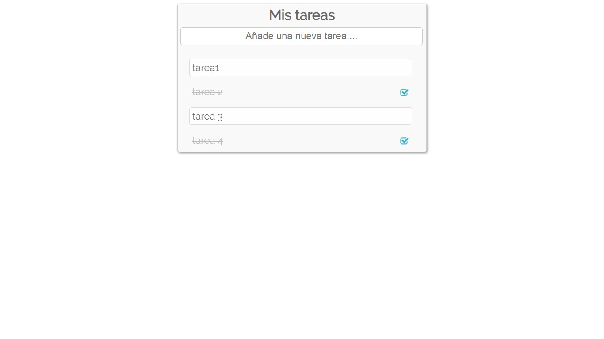

# aplicacion-de-tareas
Este es un proyecto utilizando el framework Vue.js

### Funcionalidades

Esta aplicacion web consiste que el usuario puede crear una tarea,visualizar y eliminar la tarea

### Aplicacion de tareas en vue.js
 

